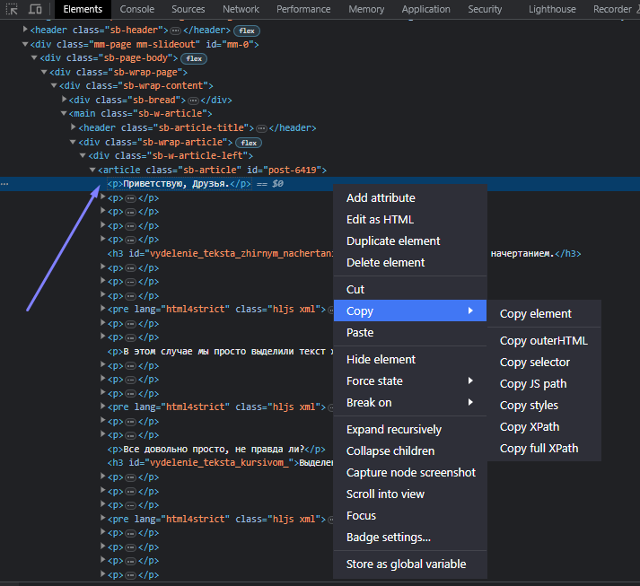
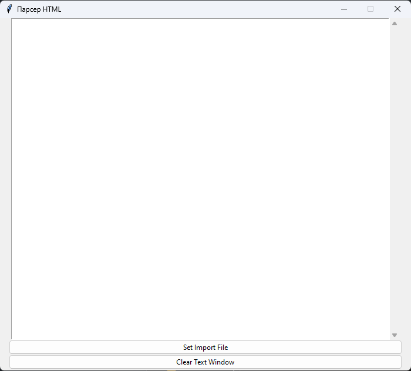
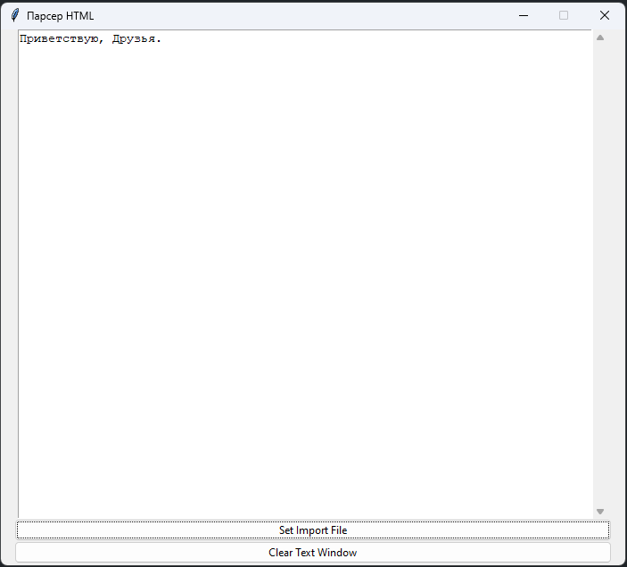
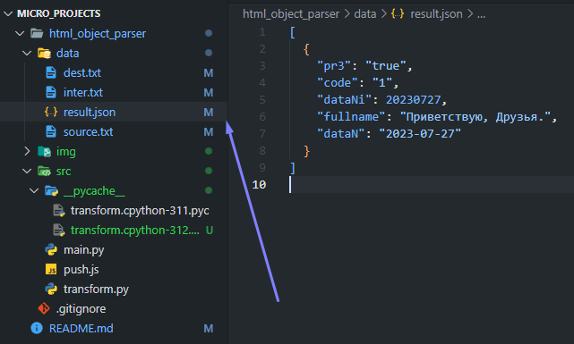

# 🌱 Небольшие проекты

## 🏵️ HTML Object Parser
> Небольшой парсер HTML, позволяющий достать из HTML данные и подготовить файл JSON формата для дальнейшего использования в скрипте

## Installation
> Перед использованием требуется установка следующих компонентов: 

| Project | Requirements | Commands |
| ------ | ------ | ------ |
| HTML OP | Tkinter | pip install tk
| ... | ... | ... |

## Run
> Для запуска выполнить команду `py src/main.py`, находясь в директории `html_object_parser`

<details open>
<summary>Пример запуска</summary>
1. Подготовка файла с текстом HTML, из которого требуется выделить текст / подготовить JSON<br>
<br>
2. После зпуска приложения нажать <span style="color: #00FF7F;">Set Import File</span>, выбрать в ФС (файловой системе) файл с расширением <span style="color: #1E90FF;">.txt</span>, содержащий текст HTML (для удобства я использую файл source из директории проекта <span style="color: #FF69B4;">data</span>)
<br>
3. После обработки в окно приложения будет выведен текст после экстракции текста из текста HTML<br>
<br>
4. В файле <span style="color: #FFFF00;">result.json</span> находятся подготовленные для импорта данные<br>
<br>
4. Для очистки экрана приложения необходимо нажать <span style="color: #00FF7F;">Clear Text Window</span>. В противном случае, при очередном запуске (выборе файла), данные будут добавлены к результату предыдущих запусков
</details>

## Build .EXE
> Для удобства использования можно собрать исполняемый файл

> [!IMPORTANT]
> После сборки переместить .exe файл из директории dist в корневую директорию микропроекта html_object_parser

```
pip install pyinstaller
pyinstaller --noconsole --onefile src/main.py
```
